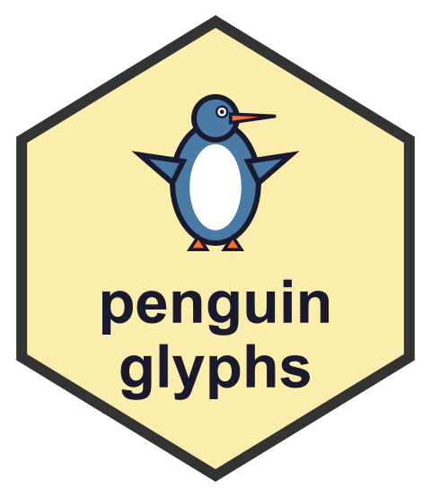
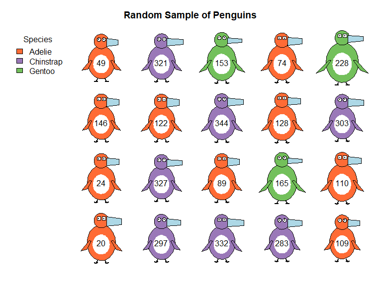
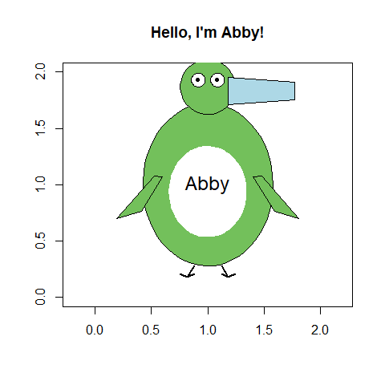
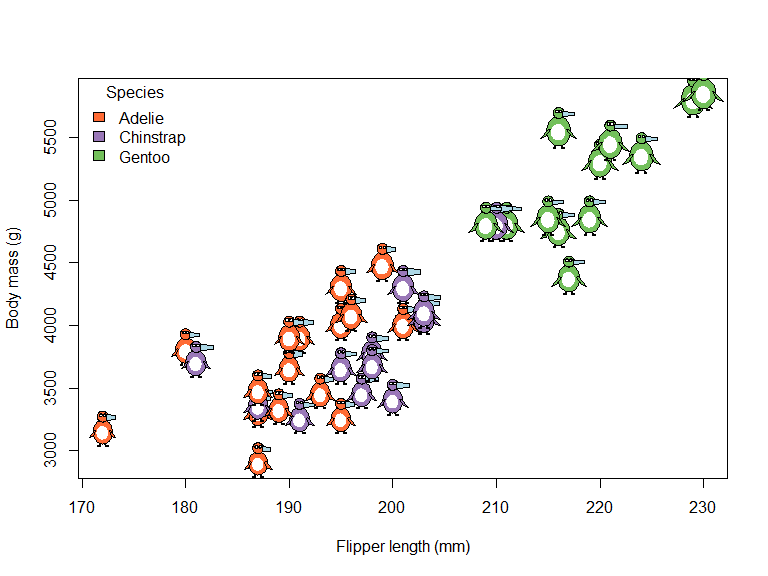
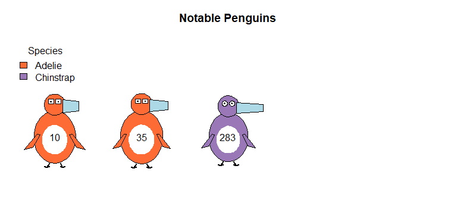
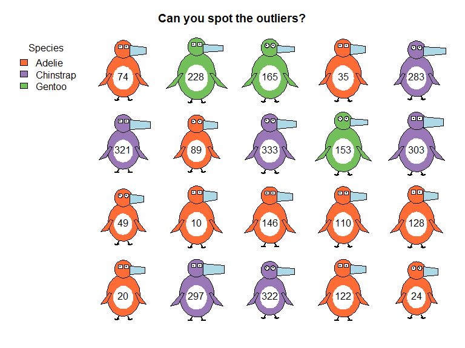
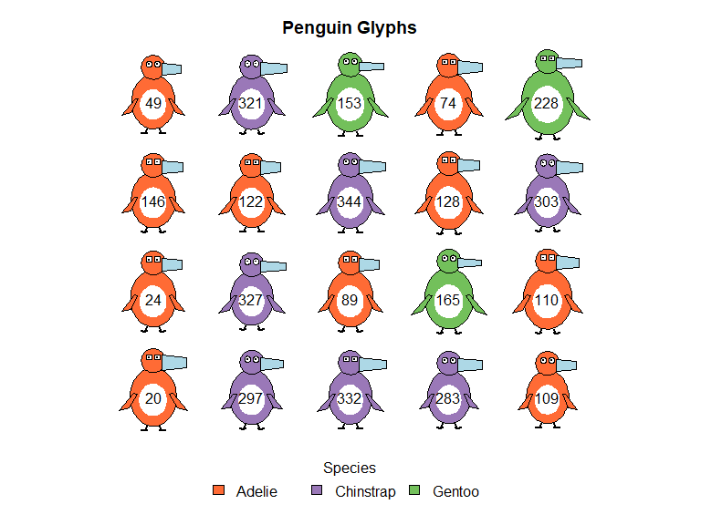

<!-- README.md is generated from README.Rmd. Please edit that file -->
<!-- badges: start -->

[](https://lifecycle.r-lib.org/articles/stages.html#experimental)

<!-- badges: end -->

# penguinglyphs 

An experiment in visualizing multivariate penguin data as schematic
penguin drawings. Physical measurements are mapped to visual features of
penguin glyphs, making patterns in the data immediately apparent. Or do
they? Designed to test some ideas in using glyphs to represent
multivariate data, in a novel context.

## Installation

You can install the development version from GitHub:

``` r
# install.packages("devtools")
devtools::install_github("friendly/penguinglyphs")
```

## Visual Mappings

The package maps penguin measurements to visual features:

- **Bill length** → horizontal extent of the bill
- **Bill depth** → vertical thickness of the bill
- **Flipper length** → length of the flippers
- **Body mass** → area of the body
- **Species** → body color
  - Adelie: Orange (#FF6B35)
  - Chinstrap: Purple (#9A78B8)
  - Gentoo: Green (#73C05B)
- **Sex** → eye shape (angular for males, round for females)

Each measurement is scaled relative to its range in the full `penguins`
dataset, so a given penguin looks the same in whatever subset of the
data it is shown.

## Usage

### Basic Example

`penguin_glyphs()` draws the penguins in a data frame as a grid of
glyphs, labeled by their row names.

``` r
library(penguinglyphs)

# Load penguin data
data(penguins, package = "datasets")

# Visualize a random sample
set.seed(42)
sampled_rows <- sample(1:nrow(penguins), size = 20)
penguin_glyphs(penguins[sampled_rows, ], main = "Random Sample of Penguins")
```



A penguin with missing measurements has those parts of the glyph drawn
as dashed outlines.

### Drawing Individual Penguins

`draw_penguin()` draws a single glyph in an existing plot. Its `size` is
the height of the glyph in inches, and `cex.lab` controls the size of
the `id` label.

``` r
# Create plot area
plot(1, xlim=c(0,2), ylim=c(0,2), type="n", asp=1,
     xlab="", ylab="", main="Hello, I'm Abby!")

# Draw a penguin with custom characteristics
draw_penguin(1, 1,
             bill_len_scale = 1.2,
             body_scale = 1.4,
             species = "Gentoo",
             sex = "female",
             id = "Abby",
             size = 2.5,
             cex.lab = 1.5)
```



### Glyphs in Other Plots

Because the glyphs are sized in inches, they keep their shape in any
plot, like a plotting symbol. `penguin_points()` adds a glyph for each
row of a data frame to an existing plot, in the manner of `points()`,
and `penguin_legend()` adds a legend for the species.

``` r
peng <- na.omit(penguins)
set.seed(42)
peng <- peng[sample(nrow(peng), 40), ]

plot(body_mass ~ flipper_len, data = peng, type = "n",
     xlab = "Flipper length (mm)", ylab = "Body mass (g)")
penguin_points(peng$flipper_len, peng$body_mass, peng)
penguin_legend("topleft", peng$species)
```



### Advanced Examples

``` r
# Examine specific outliers, among the penguins with complete data.
# Renumbering the rows gives the same case numbers as in heplots::peng
peng <- na.omit(penguins)
rownames(peng) <- NULL
outliers <- c(10, 35, 283)
penguin_glyphs(peng[outliers,], main = "Notable Penguins")
```



``` r
# Create a lineup for visual inference
set.seed(42)
cast <- c(sample(1:nrow(peng), size = 17), outliers)
lineup <- sample(cast, size = length(cast))
penguin_glyphs(peng[lineup,], main = "Can you spot the outliers?")
```



``` r
# Customize legend placement
penguin_glyphs(penguins[1:20,],
               legend = list(loc = "bottom", horiz = FALSE))
```



## Key Functions

- `penguin_glyphs()` - Creates a grid display of multiple penguins from
  a data frame
- `penguin_points()` - Adds penguin glyphs to an existing plot, at given
  coordinates
- `draw_penguin()` - Draws a single penguin at specified coordinates
- `penguin_legend()`, `penguin_colors()` - Species legend, and the
  default species colors
- `normalize_var()` - Helper function that scales variables to
  appropriate visual ranges

The package also contains the dataset `crime`, rates of serious crimes
in the US states, used to illustrate Chernoff faces in the “How to Draw
a Penguin” vignette.

## Why Glyphs?

Glyph-based visualizations allow you to see patterns across multiple
dimensions simultaneously. Larger penguins with longer flippers appear
visibly different from smaller ones, and species differences are
immediately apparent through color. This makes it easy to spot outliers,
clusters, and relationships that might be hidden in traditional plots.

## Related

This package is designed to work with what was originally the [Palmer
Penguins](https://allisonhorst.github.io/palmerpenguins/) dataset, but
now (R 4.5.0) in `datasets::penguins`, a popular alternative to the iris
dataset for data exploration and visualization examples.

## License

MIT
