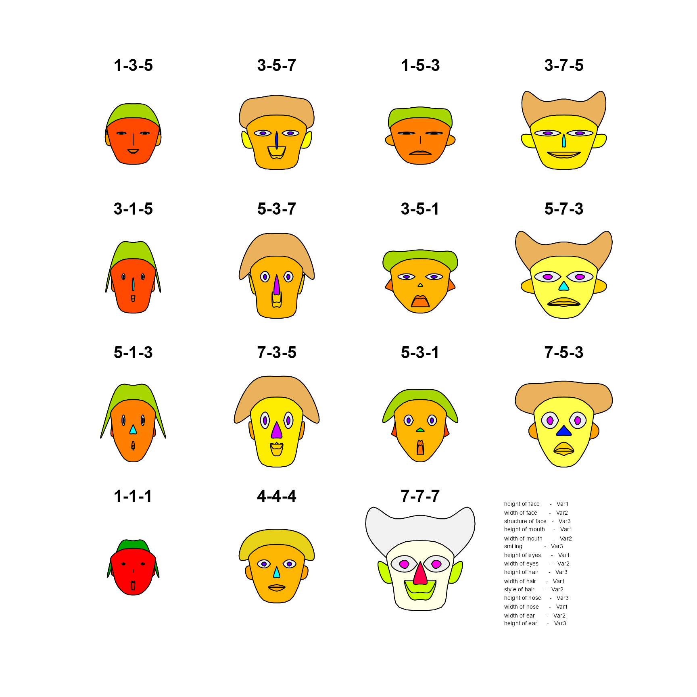
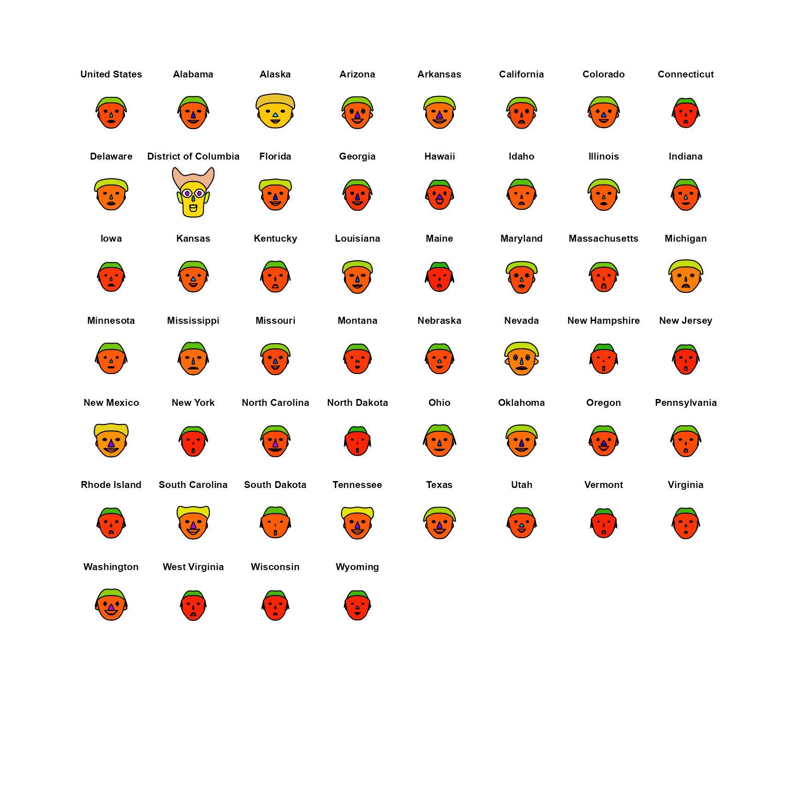

# How to Draw a Penguin

``` r
library(penguinglyphs)
library(aplpack)
```

### Glyphs

Drawing a glyph to represent a multivariate observation entails mapping
the values of variables onto visual features of the glyph. This is easy
when the glyph is a simple geometric shape, as in Edgar Anderson’s
(1957), use of circular glyphs with rays whose angles and lengths could
represent numerous variables.

![Illustration of Edgar Anderson's \[-@Anderson:1957\] glyphs for
multivariate data.](../reference/figures/anderson_glyphs1.jpg)

Illustration of Edgar Anderson’s (1957) glyphs for multivariate data.

A more interesting idea for glyphs due to Chernoff (1973) is to assign
variables to features of a human face, such as the size and shape of
eyes, ears, nose and hair, based on the values in a dataset. The
assumption is that we can read people’s faces easily in real life, so we
should be able to recognize small differences when they represent data.
(**fig-faces-yau?**) shows this idea using data on rates of serious
crime (murder, rape, aggravated assault, ..) in the US states. This
figure comes from Nathan Yau’s [How to visualize data with cartoonish
faces ala
Chernoff](https://flowingdata.com/2010/08/31/how-to-visualize-data-with-cartoonish-faces/).


Chernoff-style faces example from Nathan Yau

This was drawn using the function
[`aplpack::faces()`](https://rdrr.io/pkg/aplpack/man/faces.html). The
modern version also applies color to the eyes, hair, lips and ears;
however, these colors cannot be assigned to variables in the dataset. If
you call [`faces()`](https://rdrr.io/pkg/aplpack/man/faces.html) without
any data, it gives a demo using three variables.

``` r
faces() 
#> effect of variables:
#>  modified item       Var   
#>  "height of face   " "Var1"
#>  "width of face    " "Var2"
#>  "structure of face" "Var3"
#>  "height of mouth  " "Var1"
#>  "width of mouth   " "Var2"
#>  "smiling          " "Var3"
#>  "height of eyes   " "Var1"
#>  "width of eyes    " "Var2"
#>  "height of hair   " "Var3"
#>  "width of hair   "  "Var1"
#>  "style of hair   "  "Var2"
#>  "height of nose  "  "Var3"
#>  "width of nose   "  "Var1"
#>  "width of ear    "  "Var2"
#>  "height of ear   "  "Var3"
```



``` r
data(crime, package = "penguinglyphs")
str(crime)
#> 'data.frame':    52 obs. of  8 variables:
#>  $ state              : chr  "United States" "Alabama" "Alaska" "Arizona" ...
#>  $ murder             : num  5.6 8.2 4.8 7.5 6.7 6.9 3.7 2.9 4.4 35.4 ...
#>  $ forcible_rape      : num  31.7 34.3 81.1 33.8 42.9 26 43.4 20 44.7 30.2 ...
#>  $ robbery            : num  140.7 141.4 80.9 144.4 91.1 ...
#>  $ aggravated_assault : num  291 248 465 327 387 ...
#>  $ burglary           : num  727 954 622 948 1085 ...
#>  $ larceny_theft      : num  2286 2650 2599 2965 2711 ...
#>  $ motor_vehicle_theft: num  417 288 391 924 262 ...
```

The call to [`faces()`](https://rdrr.io/pkg/aplpack/man/faces.html)
draws the faces and prints a list of the assignment of variables to
visual features:

``` r
faces(crime[, 2:8], 
      labels = crime$state,
      cex = 1)
```



    #> effect of variables:
    #>  modified item       Var                  
    #>  "height of face   " "murder"             
    #>  "width of face    " "forcible_rape"      
    #>  "structure of face" "robbery"            
    #>  "height of mouth  " "aggravated_assault" 
    #>  "width of mouth   " "burglary"           
    #>  "smiling          " "larceny_theft"      
    #>  "height of eyes   " "motor_vehicle_theft"
    #>  "width of eyes    " "murder"             
    #>  "height of hair   " "forcible_rape"      
    #>  "width of hair   "  "robbery"            
    #>  "style of hair   "  "aggravated_assault" 
    #>  "height of nose  "  "burglary"           
    #>  "width of nose   "  "larceny_theft"      
    #>  "width of ear    "  "motor_vehicle_theft"
    #>  "height of ear   "  "murder"

## Penguin glyphs

Chernoff faces work, to the extent that they do, because we are
practiced at reading faces. But the assignment of variables to facial
features is arbitrary: nothing about a murder rate suggests the height
of a face, and a different assignment can give a quite different
impression of the same data.

The idea behind `penguinglyphs` is to try a glyph that is a schematic
picture of the thing that was measured. Here, the assignment of
variables to features is not arbitrary at all: a penguin with a long
bill is drawn as a penguin with a long bill.

### Anatomy of a penguin

The glyph is assembled from a few simple shapes, drawn with
[`polygon()`](https://rdrr.io/r/graphics/polygon.html) and
[`segments()`](https://rdrr.io/r/graphics/segments.html): an ellipse for
the body, with a smaller white one for the belly; a circle for the head;
a tapered quadrilateral for the bill; a square or circle for each eye;
quadrilaterals for the flippers; and a few line segments for the feet.
The four measurements in the `penguins` data each control the size of
one of these parts, and the two categorical variables control color and
shape.


Anatomy of a penguin glyph: the visual features, and the variables they
represent.

[`draw_penguin()`](https://friendly.github.io/penguinglyphs/reference/draw_penguin.md)
draws one glyph, centered at a point `(x, y)` in an existing plot. The
size of each feature is given by a scale factor, where 1 is a penguin of
average build.

### One feature at a time

Does each feature do its job? The simplest test is to vary one scale
factor at a time, holding the others at 1. In the package, measurements
are mapped to scale factors in the range 0.7 to 1.3, so each row of the
figure below shows the smallest, the middle and the largest value of one
variable.

``` r
features <- c("Bill length"    = "bill_len_scale",
              "Bill depth"     = "bill_dep_scale",
              "Flipper length" = "flipper_scale",
              "Body mass"      = "body_scale")
values <- c(0.7, 1, 1.3)

op <- par(mar = c(4, 8, 1, 1))
plot(1, type = "n", xlim = c(0.5, 3.5), ylim = c(4.5, 0.5),
     axes = FALSE, xlab = "Scale factor", ylab = "")
axis(1, at = 1:3, labels = values, tick = FALSE)
axis(2, at = 1:4, labels = names(features), tick = FALSE, las = 1)

for (i in 1:4) {
  for (j in 1:3) {
    args <- list(x = j, y = i, size = 1.1)
    args[[features[i]]] <- values[j]
    do.call(draw_penguin, args)
  }
}
```


Each row varies one feature of the glyph over its range, with the others
held constant.

``` r
par(op)
```

Each feature does change visibly, and nothing else changes with it, but
the features are not equally easy to read. Body mass is still the most
conspicuous, even though it is shown by area. It also moves the head and
the feet, because the head sits on top of the body. Flipper length is
the weakest: the difference between the shortest and the longest
flippers is clear when they are side by side, but it is not large. Bill
length and bill depth are separate features, but they are parts of one
shape, and in practice they are read together: a long, thin bill as
opposed to a short, deep one.

The two categorical variables are shown by color and by the shape of the
eyes.

``` r
species <- c("Adelie", "Chinstrap", "Gentoo")
sexes <- c("male", "female")

op <- par(mar = c(1, 6, 3, 1))
plot(1, type = "n", xlim = c(0.5, 3.5), ylim = c(2.5, 0.5),
     axes = FALSE, xlab = "", ylab = "")
axis(3, at = 1:3, labels = species, tick = FALSE)
axis(2, at = 1:2, labels = sexes, tick = FALSE, las = 1)

for (i in 1:2) {
  for (j in 1:3) {
    draw_penguin(j, i, species = species[j], sex = sexes[i], size = 1.4)
  }
}
```


Species is shown by body color, and sex by the shape of the eyes.

``` r
par(op)
```

Color is by far the stronger of the two. The difference between square
and round eyes is easy to see at this size, but the eyes are the
smallest part of the glyph, and the difference is hard to make out when
the glyphs are drawn small, as they are in a scatterplot. This is
probably the first thing to improve in the design.

### Some design choices

A few decisions in the drawing matter for how the glyph is read.

- **Body mass is shown by the area of the body**, not by its height and
  width. A penguin twice as heavy is not twice as tall. If the scale
  factor multiplied both the height and the width of the body, its area
  would vary as the square of the scale factor: over the range 0.7 to
  1.3 that is a factor of $(1.3/0.7)^{2} \approx 3.4$, and the body
  would dominate the display. Instead, height and width are multiplied
  by the square root of the scale factor, so that area is proportional
  to it.

- **The head is the same size in every glyph.** It serves as a fixed
  frame of reference against which the length and depth of the bill, and
  the shape of the eyes, can be judged.

- **Scale factors are limited to the range 0.7 to 1.3**, so that
  differences are apparent but no glyph is grotesque. They are
  calculated from the range of each variable in the full `penguins`
  data, rather than in the penguins being plotted. A given penguin
  therefore looks the same in any display.

- **A glyph is sized in inches**, like a plotting symbol, rather than in
  the units of the axes. It keeps its shape and size whatever the scales
  or aspect ratio of the plot, as the next figure shows. This is what
  allows the glyphs to be used as the points in a scatterplot, with
  [`penguin_points()`](https://friendly.github.io/penguinglyphs/reference/penguin_points.md).

``` r
op <- par(mfrow = c(1, 2), mar = c(4, 4, 1, 1))
plot(1, type = "n", xlim = c(0, 2), ylim = c(0, 2), xlab = "x", ylab = "y")
draw_penguin(1, 1, species = "Gentoo", size = 1.2)

plot(1, type = "n", xlim = c(170, 235), ylim = c(2500, 6500), xlab = "x", ylab = "y")
draw_penguin(200, 4500, species = "Gentoo", size = 1.2)
```


The same glyph in two plots whose axes have very different scales.

``` r
par(op)
```

### Missing values

What should be drawn for a penguin that was not completely measured?
Drawing nothing hides the fact that the penguin exists, and drawing the
missing feature at some default size is a quiet lie. Instead, a part of
the glyph whose measurement is missing is drawn at the average size, but
as an unfilled, dashed outline. If the sex of the penguin is not known,
the eyes are just pupils, with no outline.

``` r
data(penguins, package = "datasets")
rows <- c(3, 4, 9, 10)
penguins[rows, ]
#>    species    island bill_len bill_dep flipper_len body_mass    sex year
#> 3   Adelie Torgersen     40.3     18.0         195      3250 female 2007
#> 4   Adelie Torgersen       NA       NA          NA        NA   <NA> 2007
#> 9   Adelie Torgersen     34.1     18.1         193      3475   <NA> 2007
#> 10  Adelie Torgersen     42.0     20.2         190      4250   <NA> 2007

penguin_glyphs(penguins[rows, ], ncol = 4, main = "")
```


Glyphs for penguins with missing data. Penguin 4 has no measurements at
all; the sex of penguins 9 and 10 was not recorded.

### Penguins as faces

Finally, how do penguin glyphs compare with Chernoff faces for the same
data? Here are the first five penguins of each species that have
complete data, shown both ways.

``` r
peng <- na.omit(penguins)
rownames(peng) <- NULL
rows <- unlist(lapply(split(seq_len(nrow(peng)), peng$species), head, n = 5))
samp <- peng[rows, ]
samp[, 1:6]
#>       species    island bill_len bill_dep flipper_len body_mass
#> 1      Adelie Torgersen     39.1     18.7         181      3750
#> 2      Adelie Torgersen     39.5     17.4         186      3800
#> 3      Adelie Torgersen     40.3     18.0         195      3250
#> 4      Adelie Torgersen     36.7     19.3         193      3450
#> 5      Adelie Torgersen     39.3     20.6         190      3650
#> 266 Chinstrap     Dream     46.5     17.9         192      3500
#> 267 Chinstrap     Dream     50.0     19.5         196      3900
#> 268 Chinstrap     Dream     51.3     19.2         193      3650
#> 269 Chinstrap     Dream     45.4     18.7         188      3525
#> 270 Chinstrap     Dream     52.7     19.8         197      3725
#> 147    Gentoo    Biscoe     46.1     13.2         211      4500
#> 148    Gentoo    Biscoe     50.0     16.3         230      5700
#> 149    Gentoo    Biscoe     48.7     14.1         210      4450
#> 150    Gentoo    Biscoe     50.0     15.2         218      5700
#> 151    Gentoo    Biscoe     47.6     14.5         215      5400
```

[`faces()`](https://rdrr.io/pkg/aplpack/man/faces.html) has 15 facial
features to assign, but there are only four measurements, so each one is
used for several features, as the listing shows.

``` r
faces(samp[, 3:6],
      labels = rownames(samp),
      nrow.plot = 3, ncol.plot = 5,
      cex = 1)
```


Chernoff faces for five penguins of each species. Rows are Adelie,
Chinstrap and Gentoo.

    #> effect of variables:
    #>  modified item       Var          
    #>  "height of face   " "bill_len"   
    #>  "width of face    " "bill_dep"   
    #>  "structure of face" "flipper_len"
    #>  "height of mouth  " "body_mass"  
    #>  "width of mouth   " "bill_len"   
    #>  "smiling          " "bill_dep"   
    #>  "height of eyes   " "flipper_len"
    #>  "width of eyes    " "body_mass"  
    #>  "height of hair   " "bill_len"   
    #>  "width of hair   "  "bill_dep"   
    #>  "style of hair   "  "flipper_len"
    #>  "height of nose  "  "body_mass"  
    #>  "width of nose   "  "bill_len"   
    #>  "width of ear    "  "bill_dep"   
    #>  "height of ear   "  "flipper_len"

``` r
penguin_glyphs(samp, main = "")
```


Penguin glyphs for the same five penguins of each species.

The faces do separate the species, even though
[`faces()`](https://rdrr.io/pkg/aplpack/man/faces.html) was not told
about species: the Gentoos in the bottom row have tall, narrow faces
unlike any of the others. But it is hard to say *what* is different
about a Gentoo without consulting the listing of which variable went
where, and several features of the face change together because they all
show the same variable.

In the penguin glyphs, species is given directly by color, and what
differs can be read from the drawing: the Gentoos have large bodies,
long flippers and thin bills, while the Chinstraps have longer bills
than the Adelies. The differences among the penguins of one species are
subtler than they are in the faces, and this is partly a matter of
scaling: [`faces()`](https://rdrr.io/pkg/aplpack/man/faces.html)
stretches each variable over the range in the 15 penguins shown, while
the glyphs use the range in the whole dataset.

Whether a glyph that looks like its subject is actually read more
accurately than a face is an empirical question. It could be tested with
the “line-up” displays (Buja et al., 2009) described in the
*Introduction* vignette.

### References

Anderson, E. (1957). A semigraphical method for the analysis of complex
problems. *Proceedings of the National Academy of Sciences*, *13*(3),
923–927.

Buja, A., Cook, D., Hofmann, H., Lawrence, M., Lee, E.-K., Swayne, D.
F., & Wickham, H. (2009). Statistical inference for exploratory data
analysis and model diagnostics. *Philosophical Transactions of the Royal
Society A: Mathematical, Physical and Engineering Sciences*,
*367*(1906), 4361–4383.
http://doi.org/[10.1098/rsta.2009.0120](https://doi.org/10.1098/rsta.2009.0120)

Chernoff, H. (1973). The use of faces to represent points in
$k$-dimensional space graphically. *Journal of the American Statistical
Association*, *68*, 361–368.
