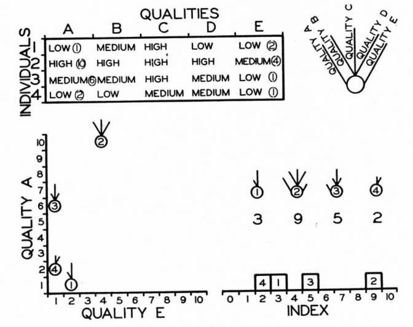
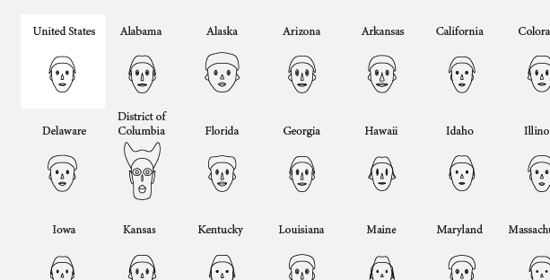

```{r, include = FALSE}
knitr::opts_chunk$set(
  collapse = TRUE,
  comment = "#>",
  fig.width = 7,
  fig.height = 5,
  fig.align = "center"
)
```

```{r setup}
library(penguinglyphs)
library(aplpack)
```

## Glyphs

Drawing a glyph to represent a multivariate observation entails mapping the values of variables onto visual features of
the glyph. This is easy when the glyph is a simple geometric shape, as in Edgar Anderson's [-@Anderson:1957], use of
circular glyphs with rays whose angles and lengths could represent numerous variables.

```{r}
#| label: fig-anderson-glyph
#| echo: false
#| out-width: "60%"
#| fig-cap: "Illustration of Edgar Anderson's [-@Anderson:1957] glyphs for multivariate data."

```

A more interesting idea for glyphs due to @Chernoff:1973 is to assign variables to features of a human face, such as the size and shape of
eyes, ears, nose and hair, based on the values in a dataset. The assumption is that we can read people’s faces easily in real life, so we should be able to recognize small differences when they represent data. 
@fig-faces-yau shows this idea using data on rates of serious crime (murder, rape, aggravated assault, ..) in the US states.
This figure comes from Nathan Yau's [How to visualize data with cartoonish faces ala Chernoff](https://flowingdata.com/2010/08/31/how-to-visualize-data-with-cartoonish-faces/).

```{r}
#| label: fig-faces-yau
#| echo: false
#| out-width: "70%"
#| fig-cap: "Chernoff-style faces example from Nathan Yau"

```

This was drawn using the function `aplpack::faces()`. The modern version also applies color to the eyes, hair, lips and ears;
however, these colors cannot be assigned to variables in the dataset.
If you call `faces()` without any data, it gives a demo using three variables.

```{r}
#| label: fig-faces-demo
#| fig-width: 9
#| fig-height: 9
#| out-width: "90%"
faces() 
```


```{r}
data(crime, package = "penguinglyphs")
str(crime)
```

The call to `faces()` draws the faces and prints a list of the assignment of variables to visual features:
```{r}
#| label: fig-faces-crime
#| fig-width: 9
#| fig-height: 9
#| out-width: "90%"
faces(crime[, 2:8], 
      labels = crime$state,
      cex = 1)
```


# Penguin glyphs

Chernoff faces work, to the extent that they do, because we are practiced at reading faces. But the assignment
of variables to facial features is arbitrary: nothing about a murder rate suggests the height of a face,
and a different assignment can give a quite different impression of the same data.

The idea behind `penguinglyphs` is to try a glyph that is a schematic picture of the thing that was measured.
Here, the assignment of variables to features is not arbitrary at all:
a penguin with a long bill is drawn as a penguin with a long bill.

## Anatomy of a penguin

The glyph is assembled from a few simple shapes, drawn with `polygon()` and `segments()`:
an ellipse for the body, with a smaller white one for the belly; a circle for the head; a tapered quadrilateral
for the bill; a square or circle for each eye; quadrilaterals for the flippers; and a few line segments for the feet.
The four measurements in the `penguins` data each control the size of one of these parts,
and the two categorical variables control color and shape.

```{r}
#| label: fig-anatomy
#| echo: false
#| fig-width: 7
#| fig-height: 5
#| out-width: "80%"
#| fig-cap: "Anatomy of a penguin glyph: the visual features, and the variables they represent."
# A plot region of 7 x 5 with no margins, in the same units as the figure size, so that 1 unit = 1 inch.
# The glyph is 3.2 in. high, and a glyph is 1.4 glyph units high, giving the length of a glyph unit.
op <- par(mar = c(0, 0, 0, 0))
plot.new()
plot.window(xlim = c(0, 7), ylim = c(0, 5), xaxs = "i", yaxs = "i")
x0 <- 3.3; y0 <- 2.1; size <- 3.2
u <- size / 1.4
draw_penguin(x0, y0, species = "Chinstrap", sex = "male", size = size)

# label a part of the glyph: text at `from`, with an arrow to `to`, both in glyph units
note <- function(label, from, to, pos) {
  arrows(x0 + from[1] * u, y0 + from[2] * u, x0 + to[1] * u, y0 + to[2] * u,
         length = 0.08, col = "grey30")
  text(x0 + from[1] * u, y0 + from[2] * u, label, pos = pos, xpd = TRUE)
}
note("Bill length:\nlength of the bill",       c( 0.75,  0.90), c( 0.40,  0.70), pos = 4)
note("Bill depth:\nthickness of the bill",     c( 0.78,  0.42), c( 0.56,  0.55), pos = 4)
note("Flipper length:\nlength of the flippers", c( 0.78, -0.38), c( 0.58, -0.22), pos = 4)
note("Body mass:\narea of the body",           c(-0.85,  0.05), c(-0.38,  0.15), pos = 2)
note("Species:\nbody color",                   c(-0.85, -0.45), c(-0.30, -0.30), pos = 2)
note("Sex:\neye shape",                        c(-0.70,  0.90), c(-0.10,  0.70), pos = 2)
par(op)
```

`draw_penguin()` draws one glyph, centered at a point `(x, y)` in an existing plot. The size of each feature is given
by a scale factor, where 1 is a penguin of average build.

## One feature at a time

Does each feature do its job? The simplest test is to vary one scale factor at a time, holding the others at 1.
In the package, measurements are mapped to scale factors in the range 0.7 to 1.3, so each row of the figure below
shows the smallest, the middle and the largest value of one variable.

```{r}
#| label: fig-features
#| fig-width: 7
#| fig-height: 7.5
#| out-width: "80%"
#| fig-cap: "Each row varies one feature of the glyph over its range, with the others held constant."
features <- c("Bill length"    = "bill_len_scale",
              "Bill depth"     = "bill_dep_scale",
              "Flipper length" = "flipper_scale",
              "Body mass"      = "body_scale")
values <- c(0.7, 1, 1.3)

op <- par(mar = c(4, 8, 1, 1))
plot(1, type = "n", xlim = c(0.5, 3.5), ylim = c(4.5, 0.5),
     axes = FALSE, xlab = "Scale factor", ylab = "")
axis(1, at = 1:3, labels = values, tick = FALSE)
axis(2, at = 1:4, labels = names(features), tick = FALSE, las = 1)

for (i in 1:4) {
  for (j in 1:3) {
    args <- list(x = j, y = i, size = 1.1)
    args[[features[i]]] <- values[j]
    do.call(draw_penguin, args)
  }
}
par(op)
```

Each feature does change visibly, and nothing else changes with it, but the features are not equally easy to read.
Body mass is still the most conspicuous, even though it is shown by area. It also moves the head and the feet,
because the head sits on top of the body.
Flipper length is the weakest: the difference between the shortest and the longest flippers is clear
when they are side by side, but it is not large.
Bill length and bill depth are separate features, but they are parts of one shape, and in practice
they are read together: a long, thin bill as opposed to a short, deep one.

The two categorical variables are shown by color and by the shape of the eyes.

```{r}
#| label: fig-species-sex
#| fig-width: 7
#| fig-height: 4.5
#| out-width: "80%"
#| fig-cap: "Species is shown by body color, and sex by the shape of the eyes."
species <- c("Adelie", "Chinstrap", "Gentoo")
sexes <- c("male", "female")

op <- par(mar = c(1, 6, 3, 1))
plot(1, type = "n", xlim = c(0.5, 3.5), ylim = c(2.5, 0.5),
     axes = FALSE, xlab = "", ylab = "")
axis(3, at = 1:3, labels = species, tick = FALSE)
axis(2, at = 1:2, labels = sexes, tick = FALSE, las = 1)

for (i in 1:2) {
  for (j in 1:3) {
    draw_penguin(j, i, species = species[j], sex = sexes[i], size = 1.4)
  }
}
par(op)
```

Color is by far the stronger of the two. The difference between square and round eyes is easy to see
at this size, but the eyes are the smallest part of the glyph, and the difference is hard to make out when the glyphs
are drawn small, as they are in a scatterplot. This is probably the first thing to improve in the design.

## Some design choices

A few decisions in the drawing matter for how the glyph is read.

* **Body mass is shown by the area of the body**, not by its height and width. A penguin twice as heavy is not twice
  as tall. If the scale factor multiplied both the height and the width of the body, its area would
  vary as the square of the scale factor: over the range 0.7 to 1.3 that is a factor of $(1.3 / 0.7)^2 \approx 3.4$,
  and the body would dominate the display. Instead, height and width are multiplied by the square root of the scale
  factor, so that area is proportional to it.

* **The head is the same size in every glyph.** It serves as a fixed frame of reference against which
  the length and depth of the bill, and the shape of the eyes, can be judged.

* **Scale factors are limited to the range 0.7 to 1.3**, so that differences are apparent but no glyph is grotesque.
  They are calculated from the range of each variable in the full `penguins` data, rather than in the
  penguins being plotted. A given penguin therefore looks the same in any display.

* **A glyph is sized in inches**, like a plotting symbol, rather than in the units of the axes.
  It keeps its shape and size whatever the scales or aspect ratio of the plot, as the next figure shows.
  This is what allows the glyphs to be used as the points in a scatterplot, with `penguin_points()`.

```{r}
#| label: fig-inches
#| fig-width: 8
#| fig-height: 3.5
#| out-width: "90%"
#| fig-cap: "The same glyph in two plots whose axes have very different scales."
op <- par(mfrow = c(1, 2), mar = c(4, 4, 1, 1))
plot(1, type = "n", xlim = c(0, 2), ylim = c(0, 2), xlab = "x", ylab = "y")
draw_penguin(1, 1, species = "Gentoo", size = 1.2)

plot(1, type = "n", xlim = c(170, 235), ylim = c(2500, 6500), xlab = "x", ylab = "y")
draw_penguin(200, 4500, species = "Gentoo", size = 1.2)
par(op)
```

## Missing values

What should be drawn for a penguin that was not completely measured? Drawing nothing hides the fact that
the penguin exists, and drawing the missing feature at some default size is a quiet lie.
Instead, a part of the glyph whose measurement is missing is drawn at the average size, but as an
unfilled, dashed outline. If the sex of the penguin is not known, the eyes are just pupils, with no outline.

```{r}
#| label: fig-missing
#| fig-width: 8
#| fig-height: 3
#| out-width: "90%"
#| fig-cap: "Glyphs for penguins with missing data. Penguin 4 has no measurements at all; the sex of penguins 9 and 10 was not recorded."
data(penguins, package = "datasets")
rows <- c(3, 4, 9, 10)
penguins[rows, ]

penguin_glyphs(penguins[rows, ], ncol = 4, main = "")
```

## Penguins as faces

Finally, how do penguin glyphs compare with Chernoff faces for the same data?
Here are the first five penguins of each species that have complete data, shown both ways.

```{r}
#| label: sample
peng <- na.omit(penguins)
rownames(peng) <- NULL
rows <- unlist(lapply(split(seq_len(nrow(peng)), peng$species), head, n = 5))
samp <- peng[rows, ]
samp[, 1:6]
```

`faces()` has 15 facial features to assign, but there are only four measurements, so each one is used for
several features, as the listing shows.

```{r}
#| label: fig-penguin-faces
#| fig-width: 8
#| fig-height: 6
#| out-width: "90%"
#| fig-cap: "Chernoff faces for five penguins of each species. Rows are Adelie, Chinstrap and Gentoo."
faces(samp[, 3:6],
      labels = rownames(samp),
      nrow.plot = 3, ncol.plot = 5,
      cex = 1)
```

```{r}
#| label: fig-penguin-glyphs
#| fig-width: 8
#| fig-height: 6
#| out-width: "90%"
#| fig-cap: "Penguin glyphs for the same five penguins of each species."
penguin_glyphs(samp, main = "")
```

The faces do separate the species, even though `faces()` was not told about species: the Gentoos in the bottom row
have tall, narrow faces unlike any of the others. But it is hard to say *what* is different about a Gentoo
without consulting the listing of which variable went where, and several features of the face change together
because they all show the same variable.

In the penguin glyphs, species is given directly by color, and what differs can be read from the drawing:
the Gentoos have large bodies, long flippers and thin bills, while the Chinstraps have longer bills than the Adelies.
The differences among the penguins of one species are subtler than they are in the faces, and this is partly a matter of scaling:
`faces()` stretches each variable over the range in the 15 penguins shown, while the glyphs use
the range in the whole dataset.

Whether a glyph that looks like its subject is actually read more accurately than a face is an empirical question.
It could be tested with the "line-up" displays [@Buja-etal2009] described in the *Introduction* vignette.

## References
